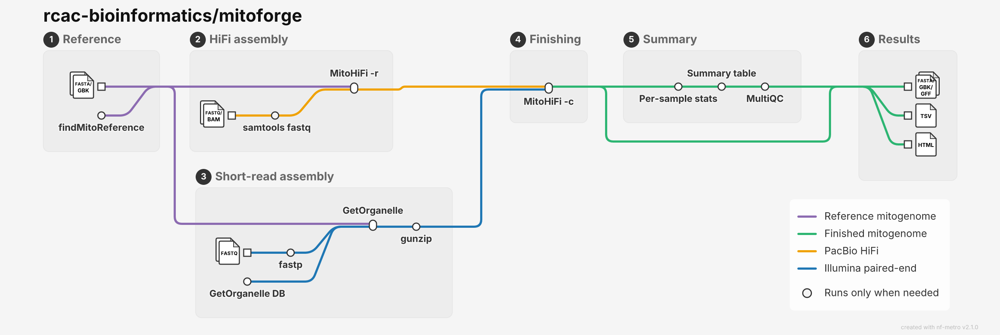

# mitoforge

Assemble, circularise and annotate animal mitochondrial genomes from PacBio HiFi or
Illumina paired-end reads, for many samples at once.

One samplesheet in, one finished mitogenome per sample out. HiFi samples are assembled
with [MitoHiFi](https://github.com/marcelauliano/MitoHiFi); Illumina samples are assembled
with [GetOrganelle](https://github.com/Kinggerm/GetOrganelle); every assembly, whichever
route it took, then goes through the same finishing step, so all samples end up with the
same files: a circularised mitogenome rotated to start at tRNA-Phe, its annotation, and
per-contig statistics.

Built on the [nf-core](https://nf-co.re) template. Runs on Purdue RCAC clusters with SLURM
and Apptainer, and on a laptop with Docker.

<picture>
  <source media="(prefers-color-scheme: dark)" srcset="assets/metro_map_dark.png">
  <source media="(prefers-color-scheme: light)" srcset="assets/metro_map_light.png">
  
</picture>

Hollow stations only run when they are needed: `findMitoReference` when the samplesheet
gives a species name rather than a reference, `samtools fastq` when the HiFi reads arrive
as BAM, and `fastp` unless you pass `--skip_trimming`.

The file icons on the left are not separate inputs. You pass one `--input
samplesheet.csv`, and each icon is a group of columns in it: `ref_fa` and `ref_gb`,
`fastq_1` or `bam` for HiFi rows, `fastq_1` and `fastq_2` for Illumina rows. See
[the samplesheet reference](https://rcac-bioinformatics.github.io/mitoforge/samplesheet/).

## Run it

```bash
nextflow run rcac-bioinformatics/mitoforge \
    -profile purdue_gautschi \
    --input samplesheet.csv \
    --outdir results \
    --cluster_account myaccount
```

or, the short way:

```bash
bin/run.sh samplesheet.csv purdue_gautschi
```

## Documentation

Everything else, how to write the samplesheet, worked examples for each kind of input,
what every output file means, and what to do when a sample fails, is at
**<https://rcac-bioinformatics.github.io/mitoforge/>**.

New to it? Start with the [quick start](https://rcac-bioinformatics.github.io/mitoforge/quick-start/):
five commands from clone to results.

## Status

Version 0.1.0. What changed, and what is known to be broken, is in
[`CHANGELOG.md`](CHANGELOG.md).

The Gautschi profiles are **untested on cluster**: they were written
from documentation on a machine with no SLURM. Please
[open an issue](https://github.com/rcac-bioinformatics/mitoforge/issues) with anything
that does not work.

## Credits

mitoforge is written and maintained by Arun Seetharam at the Rosen Center for Advanced
Computing, Purdue University.

It wraps existing tools rather than reimplementing them. Please cite them: see
[`CITATIONS.md`](CITATIONS.md). To cite mitoforge itself, see
[`CITATION.cff`](CITATION.cff).

This pipeline uses code and infrastructure developed and maintained by the
[nf-core](https://nf-co.re) community, reused here under the
[MIT license](https://github.com/nf-core/tools/blob/main/LICENSE).

> **The nf-core framework for community-curated bioinformatics pipelines.**
>
> Philip Ewels, Alexander Peltzer, Sven Fillinger, Harshil Patel, Johannes Alneberg,
> Andreas Wilm, Maxime Ulysse Garcia, Paolo Di Tommaso & Sven Nahnsen.
>
> _Nat Biotechnol._ 2020 Feb 13. doi: [10.1038/s41587-020-0439-x](https://dx.doi.org/10.1038/s41587-020-0439-x).
